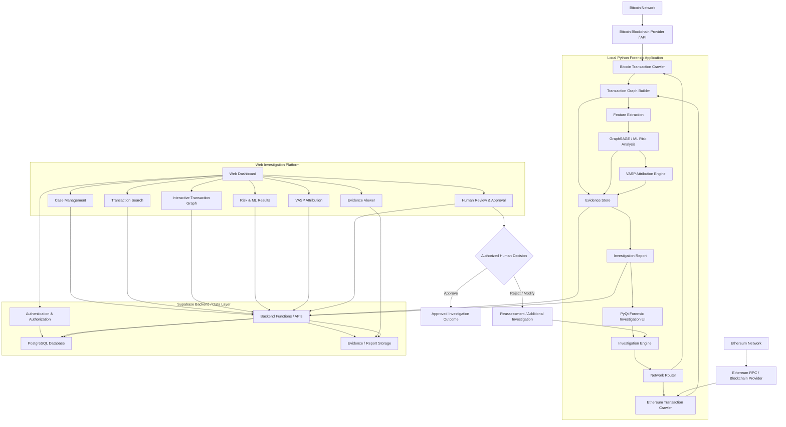
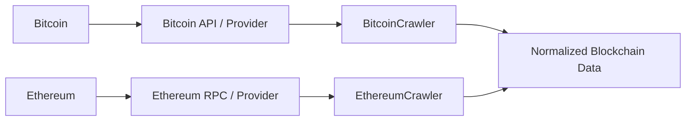
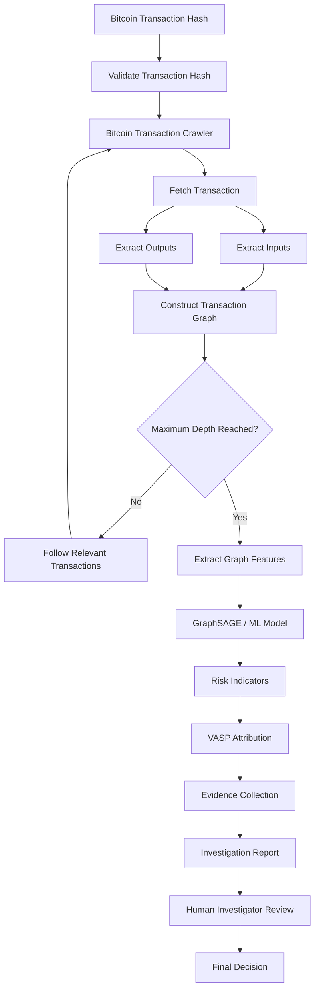
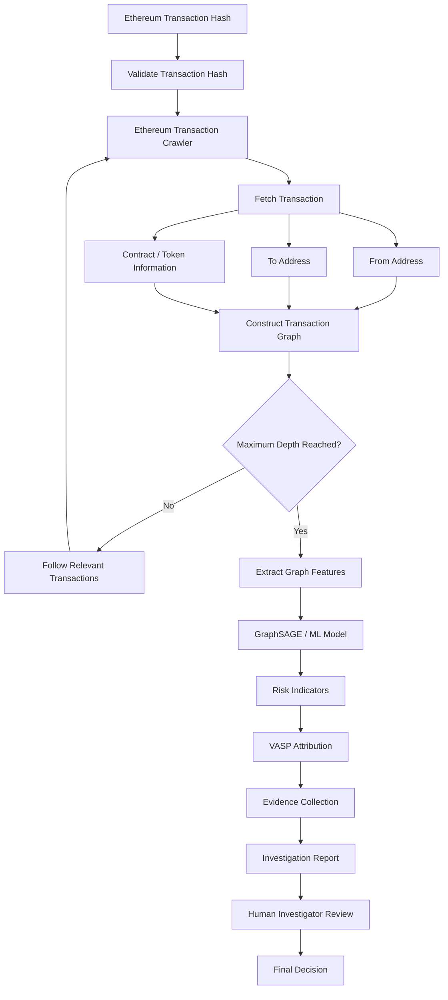
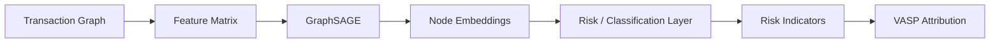
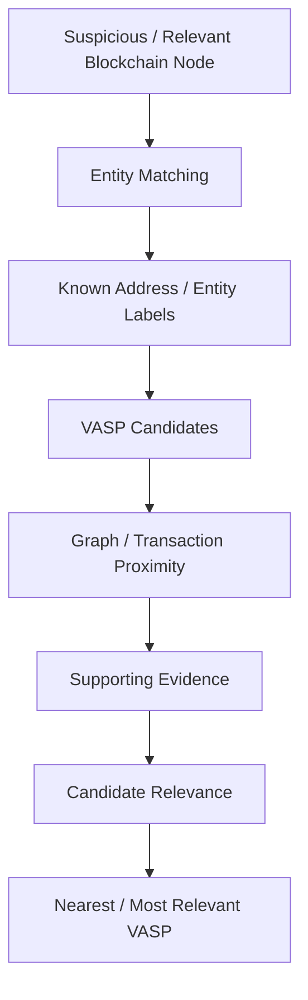
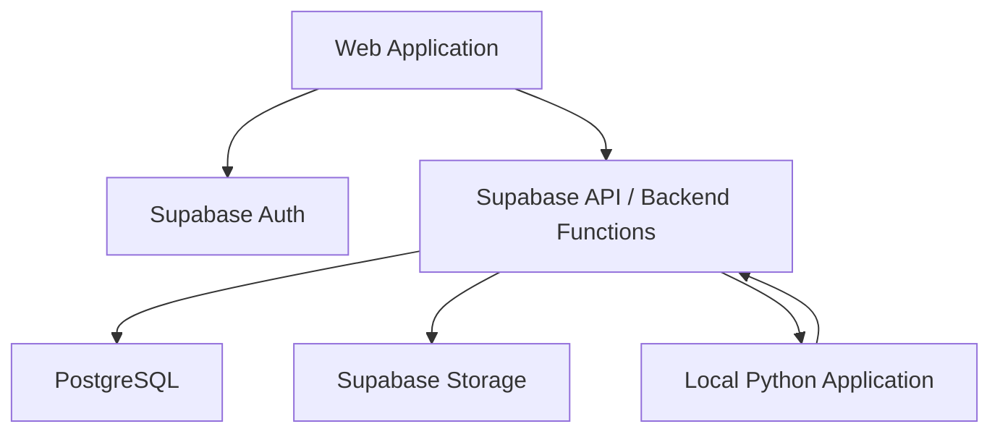
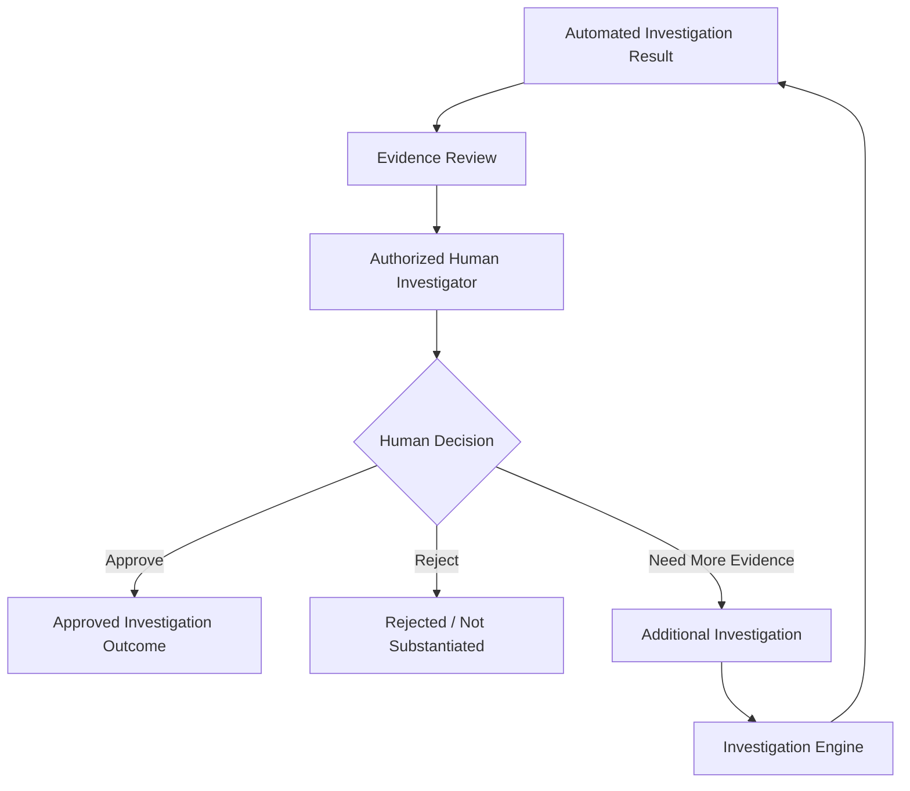
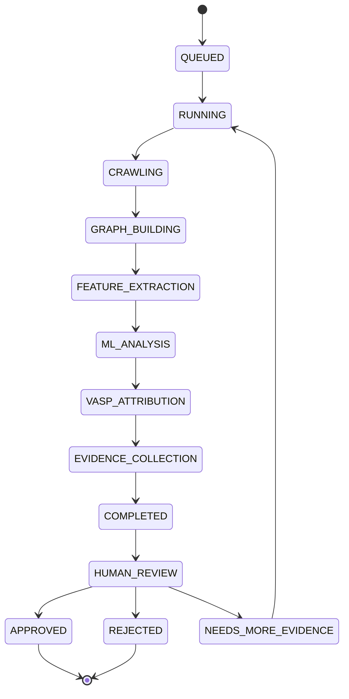
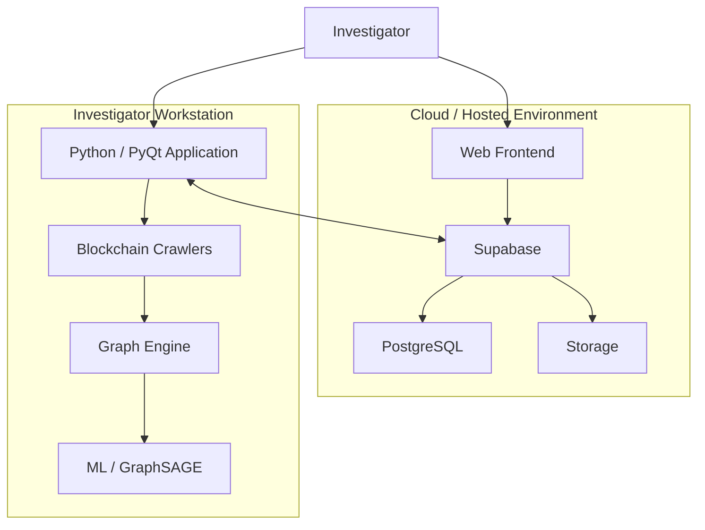

# Blockchain Forensics & Fraud Tracking System

## Detailed System Architecture & End-to-End Routing

---

## 1. System Overview

The Blockchain Forensics & Fraud Tracking System is a multi-network blockchain investigation platform designed to trace suspicious cryptocurrency transactions across **Bitcoin and Ethereum**, construct transaction relationship graphs, apply **machine-learning-based risk analysis**, identify the **nearest / most relevant Virtual Asset Service Provider (VASP)** as an investigative attribution, and present the findings to an authorized human investigator for final review.

The system combines:

* Bitcoin blockchain analysis
* Ethereum blockchain analysis
* Transaction crawling
* Address and transaction graph construction
* Graph-based machine learning
* Fraud/risk scoring
* VASP attribution
* Investigation evidence collection
* Supabase-backed web services
* Web-based investigation dashboard
* Local Python/PyQt forensic investigation application
* Human-in-the-loop approval

The architecture intentionally separates the **web platform** and the **local forensic application**. They may use the same Supabase-backed investigation data layer, but they are **not directly coupled to each other**.

---

# 2. High-Level Architecture



---

# 3. Architectural Principle

The system follows a **human-in-the-loop forensic architecture**.

The ML system does **not** independently declare a person, organization, or VASP guilty.

Instead, the pipeline produces:

1. Transaction evidence
2. Transaction relationships
3. Graph structure
4. ML-derived risk indicators
5. Suspicious-path analysis
6. VASP attribution candidates
7. Nearest / most relevant VASP
8. Confidence and supporting evidence
9. Investigation report

The final consequential decision remains with an **authorized human investigator**.

---

# 4. Major Architectural Components

## 4.1 Blockchain Networks

The system currently supports two blockchain ecosystems:

### Bitcoin

Bitcoin follows a UTXO-based transaction model.

The crawler extracts information such as:

* Transaction hash
* Input addresses
* Output addresses
* Input values
* Output values
* Transaction timestamp
* Block height
* Block hash
* Transaction fee
* Previous transaction references

---

### Ethereum

Ethereum follows an account-based transaction model.

The crawler extracts:

* Transaction hash
* From address
* To address
* Value
* Gas used
* Gas price
* Block number
* Timestamp
* Contract interaction
* Token transfers where supported
* Event information where available

---

# 5. Blockchain Data Acquisition Layer



The blockchain acquisition layer is responsible for retrieving raw blockchain information.

The crawler should be designed so that the rest of the application does not depend on a specific blockchain provider.

---

# 6. Network Router

The investigation engine receives:

```text
network
transaction_hash
max_depth
max_transactions
```

The router determines which crawler must be used.

```text
                    Investigation Request
                            |
                            v
                     Network Router
                       /          \
                      /            \
                 bitcoin          ethereum
                    |                 |
                    v                 v
             BitcoinCrawler    EthereumCrawler
```

Example:

```python
if network == "bitcoin":
    crawler = BitcoinTransactionCrawler(...)
elif network == "ethereum":
    crawler = EthereumTransactionCrawler(...)
else:
    raise ValueError("Unsupported blockchain network")
```

This keeps Bitcoin-specific and Ethereum-specific logic isolated.

---

# 7. Investigation Engine

The Investigation Engine is the central orchestration layer of the local forensic application.

Its responsibilities include:

1. Accept investigation request
2. Validate network
3. Start crawler
4. Collect blockchain transactions
5. Build transaction graph
6. Extract graph features
7. Run ML model
8. Calculate risk indicators
9. Perform VASP attribution
10. Store evidence
11. Generate investigation result
12. Synchronize result with Supabase
13. Display progress in the local UI

Conceptually:

```text
InvestigationEngine
        |
        +---- Blockchain Crawler
        |
        +---- Graph Builder
        |
        +---- Feature Extraction
        |
        +---- ML Model
        |
        +---- VASP Attribution
        |
        +---- Evidence Store
        |
        +---- Report Generator
        |
        +---- Supabase Synchronization
```

---

# 8. Bitcoin Investigation Flow



---

# 9. Ethereum Investigation Flow



---

# 10. Transaction Graph Layer

The graph layer converts raw blockchain transactions into a graph representation.

## Bitcoin Graph

Bitcoin can be represented using:

```text
Address -> Transaction -> Address
```

or a derived address-to-address representation.

Example:

```text
A
|
| 0.5 BTC
v
TX1
|
+------> B
|
+------> C
```

---

## Ethereum Graph

Ethereum can be represented as:

```text
Wallet -> Transaction -> Wallet
```

with optional contract/token relationships.

Example:

```text
Wallet A
    |
    | ETH
    v
Wallet B
    |
    | ERC-20
    v
Exchange / VASP
```

---

# 11. Graph Representation

Each node can contain attributes such as:

```text
node_id
network
address
node_type
transaction_count
incoming_volume
outgoing_volume
first_seen
last_seen
degree
```

Possible node types:

```text
ADDRESS
WALLET
CONTRACT
TRANSACTION
VASP
```

Edges can contain:

```text
source
target
transaction_hash
network
asset
amount
timestamp
edge_type
```

---

# 12. Feature Engineering

The graph is transformed into machine-learning features.

Potential features include:

### Transaction Features

* Transaction value
* Transaction frequency
* Transaction fee
* Number of inputs
* Number of outputs
* Input/output ratio
* Transaction age

### Address Features

* Incoming transaction count
* Outgoing transaction count
* Incoming volume
* Outgoing volume
* Address degree
* Active period
* Unique counterparties

### Graph Features

* Degree centrality
* PageRank
* Clustering coefficient
* Neighbor statistics
* Shortest-path characteristics
* Flow concentration
* Fan-in
* Fan-out

### Temporal Features

* Time between transactions
* Burst activity
* Dormancy period
* Repeated transaction intervals

These features form the input to the ML pipeline.

---

# 13. GraphSAGE / Machine Learning Layer

The ML layer analyzes transaction graph structures.



GraphSAGE is useful because transaction behavior depends not only on an individual address but also on its surrounding neighborhood.

The model can learn representations using:

```text
Node Features
+
Neighbor Information
+
Graph Structure
```

---

# 14. ML Output

The ML layer should produce **investigative indicators**, rather than automatically making a legal or enforcement determination.

Example output:

```json
{
    "transaction": "TX_HASH",
    "network": "bitcoin",
    "risk_score": 0.91,
    "risk_category": "high_risk_indicator",
    "model": "GraphSAGE",
    "model_version": "1.x",
    "supporting_features": [
        "high_transaction_velocity",
        "high_out_degree",
        "rapid_fund_movement"
    ]
}
```

The UI can display:

```text
Risk Indicator
██████████████████░░ 91%

Model: GraphSAGE
Network: Bitcoin

Observed indicators:
• High transaction velocity
• Multiple outgoing paths
• Rapid movement of funds
```

The exact meaning of the score must be documented and validated against the project's trained model and evaluation metrics.

---

# 15. VASP Attribution Layer

The VASP Attribution Engine connects observed blockchain entities to known VASP/service-provider information.

The process is:



---

# 16. Meaning of "Nearest VASP"

"Nearest VASP" should be interpreted as an **investigative attribution based on available evidence**, not as proof that the VASP is responsible for the suspicious activity.

Possible proximity signals include:

* Number of graph hops
* Direct transaction relationship
* Known labeled address
* Transaction frequency
* Value transferred
* Temporal relationship
* Address clustering evidence
* Confidence of external attribution
* Entity-label source

Example:

```text
Suspicious Address
       |
       | 1 hop
       v
Known Service Address
       |
       v
VASP Candidate
```

The system can report:

```text
Nearest / Most Relevant VASP Candidate:
Example VASP

Graph Distance:
1 hop

Attribution Confidence:
0.87

Supporting Evidence:
- Known address association
- Direct transaction relationship
- Temporal proximity
```

The UI should clearly distinguish **attribution evidence** from **proof of wrongdoing**.

---

# 17. Evidence Layer

Every investigation should create an auditable evidence package.

Example:

```text
Investigation
│
├── Case Metadata
│
├── Transaction Data
│
├── Blockchain Evidence
│
├── Address Evidence
│
├── Graph Evidence
│
├── Feature Data
│
├── ML Results
│
├── VASP Attribution
│
├── Model Version
│
├── Evidence Sources
│
├── Timestamps
│
└── Human Review
```

Evidence should preserve:

* Original transaction hashes
* Blockchain/network
* Block number/height
* Retrieved timestamps
* Provider/source
* Graph relationships
* Model version
* Feature version
* Attribution source
* Investigation ID
* Analyst actions
* Approval status

This creates traceability and supports later review.

---

# 18. Supabase Architecture

Supabase acts as the shared backend/data layer for the web platform and synchronization layer for investigation results.



The local Python application and web application remain separate clients.

They communicate through the shared backend/data layer rather than directly calling one another.

---

# 19. Suggested Database Structure

## investigations

```text
investigation_id
case_id
network
transaction_hash
status
created_at
completed_at
created_by
```

---

## transactions

```text
transaction_id
investigation_id
network
tx_hash
block_number
timestamp
from_address
to_address
value
fee
```

---

## addresses

```text
address_id
investigation_id
network
address
address_type
first_seen
last_seen
```

---

## graph_nodes

```text
node_id
investigation_id
network
address
node_type
features
```

---

## graph_edges

```text
edge_id
investigation_id
source_node
target_node
tx_hash
amount
asset
timestamp
```

---

## ml_results

```text
result_id
investigation_id
model_name
model_version
risk_score
risk_category
features
created_at
```

---

## vasp_candidates

```text
candidate_id
investigation_id
vasp_name
network
entity_id
graph_distance
attribution_confidence
evidence
```

---

## evidence

```text
evidence_id
investigation_id
evidence_type
source
reference
hash
metadata
created_at
```

---

## human_reviews

```text
review_id
investigation_id
reviewer_id
decision
comments
created_at
```

---

# 20. Web Application Architecture

The web application is intended for centralized case visibility and investigation management.

```text
Web Browser
     |
     v
Frontend
     |
     v
Supabase Authentication
     |
     v
Supabase API / Backend Functions
     |
     +------ PostgreSQL
     |
     +------ Storage
```

The web dashboard can contain:

### Dashboard

```text
Cases
Investigations
Risk Indicators
Recent Activity
```

### Transaction Search

```text
Network
Transaction Hash
Address
Case ID
```

### Graph View

```text
Address
   |
Transaction
   |
Address
   |
VASP Candidate
```

### Risk View

```text
ML Model
Risk Indicator
Supporting Features
Model Version
```

### VASP View

```text
Candidate VASP
Graph Distance
Attribution Confidence
Supporting Evidence
```

### Review View

```text
Evidence
|
v
Investigator Review
|
+---- Approve
|
+---- Reject
|
+---- Request Additional Investigation
```

---

# 21. Local Python Forensic Application

The local application is designed for deeper forensic analysis.

Suggested architecture:

```text
PyQt UI
   |
   v
Investigation Engine
   |
   +--> Blockchain Crawlers
   |
   +--> Graph Builders
   |
   +--> Feature Extraction
   |
   +--> ML Pipeline
   |
   +--> VASP Attribution
   |
   +--> Evidence Store
   |
   +--> Report Generator
   |
   +--> Supabase Sync
```

The local application can provide:

* Investigation controls
* Crawl status
* Transaction table
* Interactive graph
* ML results
* Evidence panel
* VASP attribution
* Investigation report
* Human review controls

---

# 22. Web Application and Local Application Separation

This is an important architectural requirement.

```text
                 ┌─────────────────────┐
                 │      SUPABASE       │
                 │                     │
                 │ Auth + DB + Storage │
                 └──────────┬──────────┘
                            │
              ┌─────────────┴─────────────┐
              │                           │
              │                           │
       ┌──────▼───────┐           ┌──────▼────────┐
       │ Web Frontend │           │ Local Python  │
       │              │           │ Forensic App  │
       └──────────────┘           └───────────────┘
```

The two applications are:

```text
NOT:

Web App <----> Python App

BUT:

Web App ----> Supabase <---- Python App
```

This prevents unnecessary direct coupling.

---

# 23. Complete End-to-End Routing

The complete investigation route is:

```text
USER
 |
 | Submit Transaction
 v
WEB APPLICATION
 |
 v
SUPABASE
 |
 v
INVESTIGATION RECORD
 |
 v
LOCAL FORENSIC APPLICATION
 |
 v
INVESTIGATION ENGINE
 |
 v
NETWORK ROUTER
 |
 +--------------------------+
 |                          |
 v                          v
BITCOIN                  ETHEREUM
CRAWLER                   CRAWLER
 |                          |
 v                          v
BLOCKCHAIN DATA
 |
 v
GRAPH BUILDER
 |
 v
TRANSACTION GRAPH
 |
 v
FEATURE EXTRACTION
 |
 v
GRAPHSAGE / ML
 |
 v
RISK INDICATORS
 |
 v
VASP ATTRIBUTION
 |
 v
NEAREST / MOST RELEVANT
VASP CANDIDATE
 |
 v
EVIDENCE COLLECTION
 |
 v
INVESTIGATION REPORT
 |
 v
SUPABASE
 |
 v
WEB DASHBOARD
 |
 v
HUMAN INVESTIGATOR
 |
 v
FINAL REVIEW
 |
 +-----------------------+
 |                       |
 v                       v
APPROVE               REJECT / REASSESS
 |                       |
 v                       v
FINAL OUTCOME        ADDITIONAL INVESTIGATION
```

---

# 24. Detailed Request Routing

## Step 1 — User submits transaction

Example:

```json
{
    "network": "bitcoin",
    "transaction_hash": "abc123..."
}
```

The web application creates an investigation request.

---

## Step 2 — Case creation

Supabase creates:

```text
case_id
investigation_id
network
transaction_hash
status = "queued"
```

---

## Step 3 — Investigation starts

The local forensic application retrieves the investigation request.

Status:

```text
QUEUED
   ↓
RUNNING
```

---

## Step 4 — Network-specific crawling

For Bitcoin:

```text
Bitcoin
   ↓
BitcoinTransactionCrawler
```

For Ethereum:

```text
Ethereum
   ↓
EthereumTransactionCrawler
```

---

## Step 5 — Graph construction

Crawler output is converted into graph nodes and edges.

```text
Raw Blockchain Data
        ↓
Normalization
        ↓
Graph Builder
        ↓
Transaction Graph
```

---

## Step 6 — Feature extraction

```text
Transaction Graph
       ↓
Feature Extraction
       ↓
Feature Matrix
```

---

## Step 7 — ML inference

```text
Feature Matrix
       ↓
GraphSAGE
       ↓
Embeddings
       ↓
Risk / Classification Layer
       ↓
Risk Indicators
```

---

## Step 8 — VASP attribution

The system examines the relevant transaction neighborhood and known entity labels.

```text
Relevant Blockchain Nodes
          ↓
Entity Matching
          ↓
VASP Candidates
          ↓
Graph Proximity
          ↓
Evidence
          ↓
Attribution Result
```

---

## Step 9 — Evidence generation

The system stores:

```text
Blockchain Evidence
+
Graph Evidence
+
ML Evidence
+
VASP Attribution Evidence
```

---

## Step 10 — Result synchronization

The local application sends the completed investigation result to Supabase.

```text
Local Application
       ↓
Supabase API
       ↓
PostgreSQL
       +
Storage
```

---

## Step 11 — Web dashboard

The dashboard retrieves:

```text
Investigation
Transactions
Graph
Risk Indicators
VASP Candidates
Evidence
Report
```

---

## Step 12 — Human review

The investigator reviews:

```text
Transaction Evidence
        +
Graph
        +
ML Indicators
        +
VASP Attribution
        +
Supporting Evidence
```

The investigator then makes the final authorized decision.

---

# 25. Human-in-the-Loop Control

The system must not automatically convert an ML result into an enforcement action.

The final stage is:



This ensures that:

```text
ML
 ↓
Recommendation / Indicator
 ↓
Human Review
 ↓
Authorized Decision
```

rather than:

```text
ML
 ↓
Automatic Enforcement
```

---

# 26. Final Investigation Output

The final investigation package should contain:

```text
┌─────────────────────────────────────┐
│       INVESTIGATION RESULT          │
├─────────────────────────────────────┤
│ Case ID                             │
│ Network                             │
│ Transaction Hash                    │
│                                     │
│ Transaction Evidence                │
│ Transaction Graph                   │
│                                     │
│ ML Risk Indicators                  │
│ Model Version                       │
│ Supporting Features                 │
│                                     │
│ VASP Candidates                     │
│ Nearest / Relevant VASP             │
│ Graph Distance                      │
│ Attribution Confidence              │
│ Attribution Evidence                │
│                                     │
│ Evidence References                 │
│                                     │
│ Human Review Status                 │
│ Reviewer                            │
│ Decision                            │
│ Timestamp                           │
└─────────────────────────────────────┘
```

---

# 27. Final Outcomes

The architecture is designed to produce the following final outcomes:

### Outcome 1 — Transaction Trace

The system traces the submitted Bitcoin or Ethereum transaction through the configured investigation depth.

---

### Outcome 2 — Transaction Graph

The system produces a graph showing relevant:

```text
Addresses
Transactions
Contracts
Counterparties
```

and their relationships.

---

### Outcome 3 — ML Risk Indicators

GraphSAGE / ML analysis provides risk-related indicators based on the learned graph and transaction features.

These are investigative signals, not standalone determinations.

---

### Outcome 4 — VASP Attribution

The system identifies relevant VASP candidates associated with the investigated transaction path.

The final result should explicitly state:

```text
Nearest / Most Relevant VASP Candidate
```

along with:

```text
Graph Distance
Attribution Confidence
Supporting Evidence
Source / Label Information
```

---

### Outcome 5 — Human Approval

The investigation is presented to an authorized human investigator.

The human reviews:

```text
Blockchain Evidence
+
Graph
+
ML Results
+
VASP Attribution
+
Supporting Evidence
```

Only after this review can the case be marked as an approved investigation outcome or sent for whatever authorized downstream action is applicable.

---

# 28. Investigation State Machine



---

# 29. Error Handling

Every stage should support explicit failure states.

```text
QUEUED
RUNNING
CRAWLING
GRAPH_BUILDING
ML_ANALYSIS
VASP_ATTRIBUTION
COMPLETED
FAILED
```

Example:

```text
Blockchain Provider Failure
        ↓
Crawler Error
        ↓
Investigation Status = FAILED
        ↓
Error Logged
        ↓
Human Can Retry
```

The system should never silently convert missing blockchain data into a successful investigation.

---

# 30. Data Integrity

Important blockchain identifiers should be treated as immutable evidence references.

Examples:

```text
Transaction Hash
Block Hash
Block Number
Address
Timestamp
Provider Response
```

For evidence artifacts, cryptographic hashes can be stored:

```text
Evidence File
     ↓
SHA-256
     ↓
Evidence Hash
```

This allows later verification that the stored artifact has not changed.

---

# 31. Security Architecture

Recommended security controls:

```text
Authentication
      ↓
Authorization
      ↓
Role-Based Access
      ↓
Case-Level Access
      ↓
Audit Logging
```

Suggested roles:

```text
ADMIN
INVESTIGATOR
ANALYST
REVIEWER
VIEWER
```

Sensitive operations such as final approval should require an authorized reviewer role.

---

# 32. Audit Logging

Important actions should be logged.

Example:

```text
User Login
Case Created
Investigation Started
Transaction Crawled
Graph Generated
ML Analysis Completed
VASP Candidate Generated
Evidence Added
Report Generated
Human Review Started
Decision Submitted
```

Example:

```json
{
    "event": "human_review_completed",
    "investigation_id": "INV-001",
    "reviewer_id": "USER-123",
    "decision": "approved",
    "timestamp": "2026-09-30T..."
}
```

---

# 33. Model Governance

Every ML result should record:

```text
Model Name
Model Version
Training Dataset Version
Feature Version
Inference Timestamp
Threshold Configuration
```

Example:

```text
Model:
GraphSAGE

Version:
1.0

Feature Version:
1.2

Inference:
2026-09-30T...
```

This is important because an investigator should be able to understand which model generated a historical result.

---

# 34. Explainability

The ML interface should avoid displaying only:

```text
Risk Score: 91%
```

Instead it should show supporting indicators such as:

```text
Risk Indicators
------------------------------
High transaction velocity
High outgoing degree
Rapid fund movement
Repeated counterparties
Unusual graph pattern
```

This gives investigators contextual information for human review.

---

# 35. Deployment Architecture



The architecture therefore supports both:

```text
Cloud/Web Investigation
```

and:

```text
Local Deep Forensic Investigation
```

without requiring the web frontend and local Python application to directly communicate.

---

# 36. Complete Architecture Summary

```text
                         ┌──────────────────────┐
                         │      BITCOIN         │
                         └──────────┬───────────┘
                                    │
                         ┌──────────▼───────────┐
                         │ Bitcoin Blockchain   │
                         │ Provider / API       │
                         └──────────┬───────────┘
                                    │
                                    │
                         ┌──────────▼───────────┐
                         │                      │
                         │  LOCAL PYTHON APP    │
                         │                      │
                         │ Investigation Engine │
                         └──────────┬───────────┘
                                    │
                                    │
                  ┌─────────────────┴─────────────────┐
                  │                                   │
         ┌────────▼────────┐                 ┌────────▼────────┐
         │ Bitcoin Crawler │                 │ Ethereum Crawler│
         └────────┬────────┘                 └────────┬────────┘
                  │                                   │
                  └─────────────────┬─────────────────┘
                                    │
                           ┌────────▼────────┐
                           │ Transaction     │
                           │ Graph Builder   │
                           └────────┬────────┘
                                    │
                           ┌────────▼────────┐
                           │ Feature         │
                           │ Extraction      │
                           └────────┬────────┘
                                    │
                           ┌────────▼────────┐
                           │ GraphSAGE / ML  │
                           └────────┬────────┘
                                    │
                           ┌────────▼────────┐
                           │ Risk Indicators │
                           └────────┬────────┘
                                    │
                           ┌────────▼────────┐
                           │ VASP Attribution│
                           └────────┬────────┘
                                    │
                           ┌────────▼────────┐
                           │ Nearest / Most  │
                           │ Relevant VASP   │
                           │ Candidate       │
                           └────────┬────────┘
                                    │
                           ┌────────▼────────┐
                           │ Evidence &      │
                           │ Report           │
                           └────────┬────────┘
                                    │
                                    ▼
                         ┌──────────────────────┐
                         │      SUPABASE        │
                         │                      │
                         │ Auth                 │
                         │ PostgreSQL           │
                         │ Storage              │
                         │ Backend APIs         │
                         └──────────┬───────────┘
                                    │
                         ┌──────────▼───────────┐
                         │    WEB DASHBOARD     │
                         │                      │
                         │ Cases                │
                         │ Transactions         │
                         │ Graph                │
                         │ ML Results           │
                         │ VASP Attribution     │
                         │ Evidence             │
                         └──────────┬───────────┘
                                    │
                         ┌──────────▼───────────┐
                         │ HUMAN INVESTIGATOR   │
                         │ REVIEW               │
                         └──────────┬───────────┘
                                    │
                         ┌──────────▼───────────┐
                         │ FINAL AUTHORIZED     │
                         │ OUTCOME              │
                         └──────────────────────┘
```

---

# 37. Final Architecture Statement

The proposed system implements an end-to-end blockchain forensic pipeline:

```text
Bitcoin / Ethereum
        ↓
Blockchain Data Acquisition
        ↓
Transaction Crawling
        ↓
Graph Construction
        ↓
Feature Extraction
        ↓
GraphSAGE / ML Analysis
        ↓
Risk Indicators
        ↓
VASP Attribution
        ↓
Nearest / Most Relevant VASP Candidate
        ↓
Evidence Package
        ↓
Supabase
        ↓
Web Investigation Dashboard
        ↓
Human Investigator Review
        ↓
Final Authorized Decision
```

The architecture therefore achieves the intended project outcome:

> **Trace suspicious cryptocurrency transactions across Bitcoin and Ethereum, model their transaction relationships as graphs, apply ML-based risk analysis, identify the nearest / most relevant VASP as an evidence-backed investigative lead, and place a human investigator at the final approval and decision stage.**

The **ML layer assists the investigator; it does not replace the investigator**.

The **VASP result is an attribution candidate supported by evidence, not an automatic finding of liability**.

The **final consequential action requires human authorization**.

---

# 38. One-Line Architecture for Presentation

```text
Bitcoin + Ethereum → Blockchain Crawling → Transaction Graph → GraphSAGE/ML → Risk Indicators → VASP Attribution → Nearest VASP Candidate → Evidence → Supabase → Web Dashboard → Human Approval → Final Outcome
```

# 39. Core Architectural Guarantees

| Requirement              | Architecture Support                     |
| ------------------------ | ---------------------------------------- |
| Bitcoin investigation    | Bitcoin crawler + graph pipeline         |
| Ethereum investigation   | Ethereum crawler + graph pipeline        |
| Multi-hop tracing        | Configurable investigation depth         |
| Transaction graph        | Graph Builder                            |
| ML analysis              | GraphSAGE / ML layer                     |
| Explainable indicators   | Feature + supporting-evidence layer      |
| VASP identification      | VASP Attribution Engine                  |
| Nearest VASP             | Graph/proximity-based candidate analysis |
| Evidence preservation    | Evidence Store + Supabase Storage        |
| Web interface            | Web Dashboard                            |
| Local forensic interface | Python/PyQt application                  |
| Web/local separation     | Both communicate through Supabase        |
| Auditability             | Investigation + review logs              |
| Human-in-the-loop        | Mandatory final review                   |
| Final approval           | Authorized human investigator            |
| Re-investigation         | `NEEDS_MORE_EVIDENCE` workflow           |
| Model traceability       | Model/version metadata                   |
| Evidence integrity       | Hashable evidence artifacts              |

---

# 40. Final Project Architecture

**The final architecture is therefore:**

```text
             BLOCKCHAIN LAYER
        ┌───────────────────────┐
        │ Bitcoin │  Ethereum   │
        └─────────┬─────────────┘
                  ↓
          DATA ACQUISITION
                  ↓
          TRANSACTION CRAWLER
                  ↓
          GRAPH CONSTRUCTION
                  ↓
          FEATURE ENGINEERING
                  ↓
             GRAPH ML
             GraphSAGE
                  ↓
           RISK INDICATORS
                  ↓
          VASP ATTRIBUTION
                  ↓
       NEAREST / RELEVANT VASP
             CANDIDATE
                  ↓
          EVIDENCE PACKAGE
                  ↓
              SUPABASE
             ↙        ↘
        WEB APP      LOCAL APP
             ↘        ↙
           INVESTIGATION
              RESULTS
                  ↓
          HUMAN INVESTIGATOR
                  ↓
          HUMAN APPROVAL
                  ↓
          FINAL OUTCOME
```

This is the final end-to-end routing and separation model for the proposed Blockchain Forensics & Fraud Tracking architecture.
